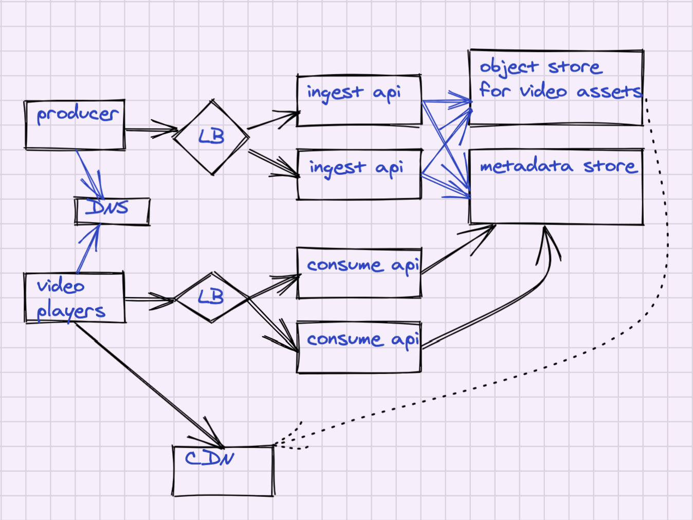

# CHAPTER 14: DESIGN YOUTUBE

## Background
YouTube looks simple: content creators upload videos, and viewers click play. But under the hood, a lot is going on. The biggest challenges are scalability, reliability, and fault tolerance.  

## Requirements

### Functional 
- Upload video
- Watch Video
- Clients to support:
    - Mobile apps
    = Web Browsers
    - Smart TV
- Support international users

### Non-Functional
- Capacity:
    - The total number of monthly active users: 2 billion
    = The number of videos watched per day: 5 billion
    - 50 million creators on YouTube
    - Average daily time spent on the product is 30 mins
    - Support multiple video resolution
    - Max file size is 1GB
- Security
    - Require encryption
- Maintainability:
    - Leverage cloud services

## System APIs
- Upload Video
= Search for Video
= Watch Video
- Like Video
- Create List
- Subscribe to a channel

## High-Level Design
Define components and data flows 

<table width="256px">
  <tr>
    <td></td>
  </tr>
</table>

## Detailed Design 
Low-Level design of each component (OOD can help)

## Analysis
- Cost
- Security
- Reliability
- Performance Efficiency
- Operation Excellence

