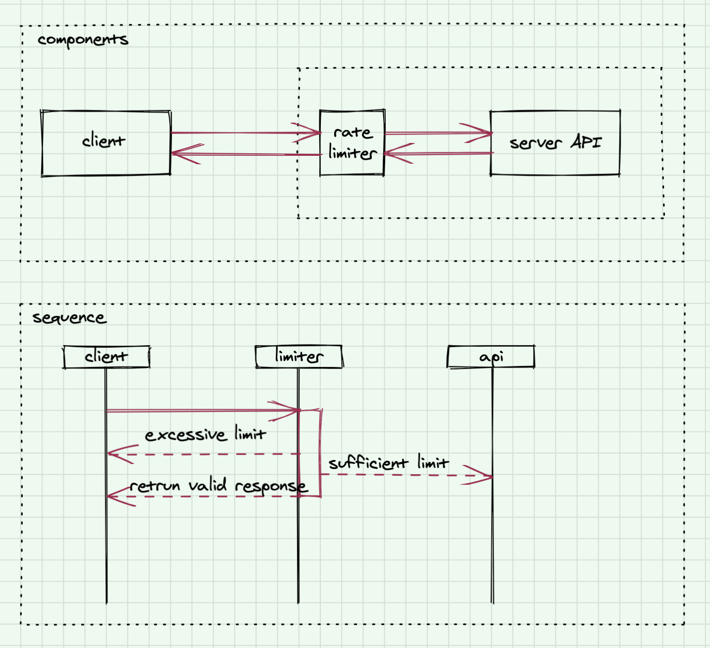

# CHAPTER 4: DESIGN A RATE LIMITER

## Background
In a network system, a rate limiter is used to control the rate of traffic sent by a client or a service. In the HTTP world, a rate limiter limits the number of client requests allowed to be sent over a specified period. If the API request count exceeds the threshold defined by the rate limiter, all the excess calls are blocked. Here are a few examples:
    - A user can write no more than 2 posts per second.
    - You can create a maximum of 10 accounts per day from the same IP address. 
    - You can claim rewards no more than 5 times per week from the same device.

## Requirements

### Functional 
- Accurately limit excessive server-side requests. 
- Low-Latency: the rate limiter should not slow down HTTP response time
- The rate limiter should be flexible enough to support different throttle rules. Examples: IP, user ID, other attributes
- Track dropped requests

### Non-Functional
- Scalability: support high-scale and distributed systems.
- Fault tolerance: if there are any problems with the rate limiter (for example, a cache server goes offline), it does not affect the entire system.

## System APIs
- setRateLimit(keyName: string, ratePerSec: int)
- checkRateLimit(keyName: string, value: string)

## High-Level Design

<table width="256px">
  <tr>
    <td></td>
  </tr>
</table>

## Detailed Design 

## Analysis
- Cost
- Security
- Reliability
- Performance Efficiency
- Operation Excellence