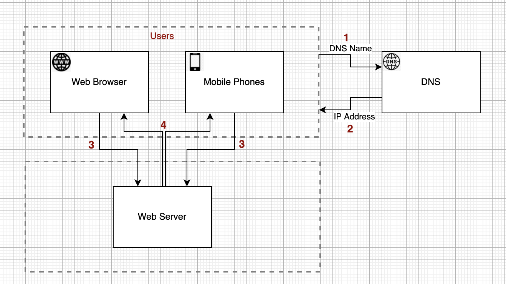
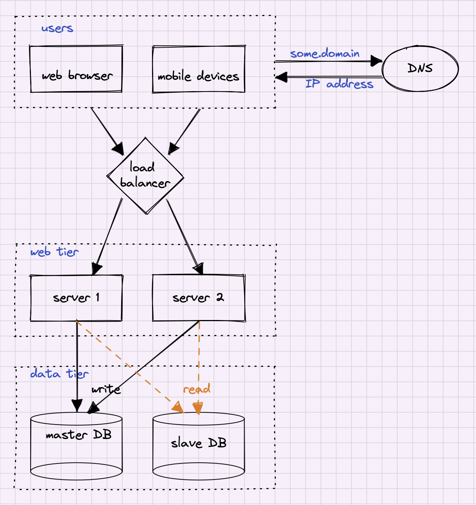

# CHAPTER 1: SCALE FROM ZERO TO MILLIONS OF USERS

## Introduction
This chapter focuses on the foundations of high-scale architecture. One of the best ways of learning architecture patterns is to design a single server system and then gradually scale it up to support more load.

## Single Server Setup
The Single Server setup is simple - all components, like web servers, databases, caches, etc are running on a single machine. 
<table width="256px">
  <tr>
    <td></td>
  </tr>
</table>
  
The flow is straightforward as well:
- User accesses the web server by using the domain name from a browser or a smartphone 
- The domain name is resolved in some a DNS server like [Route53](https://en.wikipedia.org/wiki/Amazon_Route_53) or [OpenDNS](https://en.wikipedia.org/wiki/OpenDNS).
- Once the IP is obtained, an HTTP request is sent to the Web Server
- Web Server responses by sending HTML or JSON 

## Database
When the traffic increases, one server is not enough. It makes sense to separate the Web Tier and the Database Tier. Such a separation will allow to scale out each tier independently. 
<table width="256px">
  <tr>
    <td></td>
  </tr>
</table>

## Which databases to use?
There are two types of databases: [Relational](https://en.wikipedia.org/wiki/Relational_database) (SQL) and [NoSQL](https://en.wikipedia.org/wiki/NoSQL) databases. Relational databases organize the data in tables with relations. For example, think about an online e-commerce system. We can organize the data in Customers and Orders tables, where for each customer, there are multiple entries in the Orders Table (aka one-to-many relation). An [SQL language](https://www.w3schools.com/sql/sql_intro.asp) is used to query the data in Relational Databases. The most popular Relation Databases are MySQL, Oracle, PostgreSQL.
NoSQL databases are comparably new and used when dealing with unstructured data, huge volumes of data, or when a low-latency data access is required. There are four families of NoSQL databases
- Key-Value databases
- Document databases 
- Graph Databases
- Column Databases  

Some popular NoSQL databases are CouchDB, DynamoDB, Cassandra. Neo4j, Redis, etc.

## Vertical scaling vs horizontal scaling
We can increase the power of the software component by scaling it [up](https://en.wikipedia.org/wiki/Scalability) (Vertical) or [out](https://en.wikipedia.org/wiki/Scalability) (Horizontal). Scaling up is just adding additional hardware. For example, we scale up a MySQL database by increasing the number of CPU cores of the underlying server. On the other hand, we can scale out software components by increasing the number of underlying servers. For example, we scale out MongoDB by increasing the number of underlying machines. 
Each of the methods has its limitation. We cannot scale up [infinitely](). There are certain hard limits for the number of CPU cores, RAM, and network bandwidth on each server. Another point is that the Vertical scaling doesn't have failover or redundancy. The Horizontal Scaling doesn't work in some cases too. Some software components (example: Relational Databases) cannot scale out. 

## Load balancer
A load balancer distributes incoming traffic among web servers defined in a load-balanced set. A load balancer is a crucial component to implement High Availability and Redundant systems.
1. Example 1: users will be unable to access the website if the server goes down. In this case a Load Balancer can be used to build an active-passive setup. A Load Balancer will rout the traffic to the active server and in case of server's failure the traffic will go to the second server.  
2. Example 2: The server will reach its capacity when the traffic spikes. In this case a Load Balancer can be used to build an active-active setup. The traffic will be distributed between two servers. Optionally, we can setup an autoscale to add server as traffic growth.

<table width="256px">
  <tr>
    <td></td>
  </tr>
</table>

Below is a quick overview of the most coined terms in cloud or data storage services.
- [Fault tolerance](https://sprinkle-twinkles.medium.com/availability-vs-reliability-vs-durability-vs-resiliency-dfead8c92c58) - ability that allows systems to function even when one of its components fails. Ussually achieved by [redundancy](https://en.wikipedia.org/wiki/Redundancy_(engineering)) 
- [Availability](https://sprinkle-twinkles.medium.com/availability-vs-reliability-vs-durability-vs-resiliency-dfead8c92c58) - is the system uptime. For example, High-Availablity on AWS Service usually means that it is available more than 99.9% of the time.
- [Reliability](https://sprinkle-twinkles.medium.com/availability-vs-reliability-vs-durability-vs-resiliency-dfead8c92c58) - is closely related to availability, however, a system can be ‘available’ but not be working properly. Reliability is the probability that a system will work as designed.
- [Resilience](https://sprinkle-twinkles.medium.com/availability-vs-reliability-vs-durability-vs-resiliency-dfead8c92c58) - described as the ability to a system to self-heal after damage, failure, load, or attack.
- [Durability](https://sprinkle-twinkles.medium.com/availability-vs-reliability-vs-durability-vs-resiliency-dfead8c92c58) - refers to the on-going existence of the object or resource

## Database replication
The database replication is achieved using the [master-slave](https://en.wikipedia.org/wiki/Master/slave_(technology)) technique. The Master node is usually used for writes only. And Slave replicas are used for the read operations. 
<table width="256px">
  <tr>
    <td></td>
  </tr>
</table>

This approach works well when the number of reads is much lower than the number of writes.
Database Replication advantages:
- Performance:
- Reliability: 
- High Availablity
- 

## Cache
- Cache Tier
- Consideration for using Cache

## Content delivery network (CDN)

## Stateful Architecture

## Stateless Architecture

## Message queue

## Logging, metrics, automation

## Database scaling
- Vertical
- Horizontal

